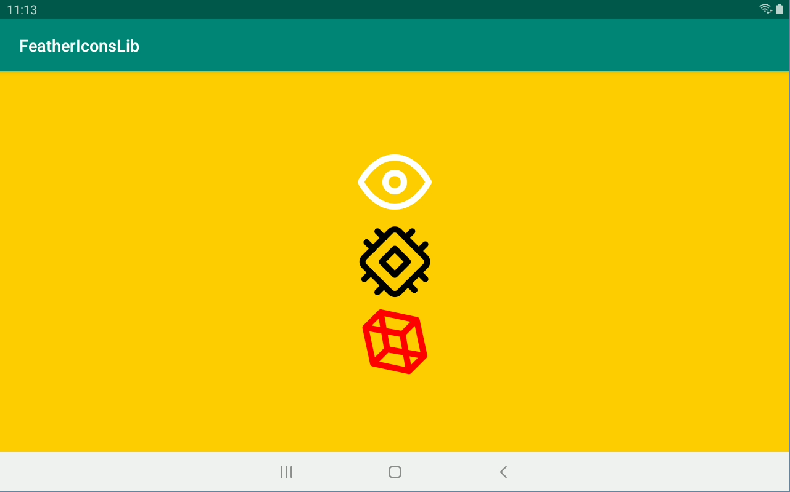
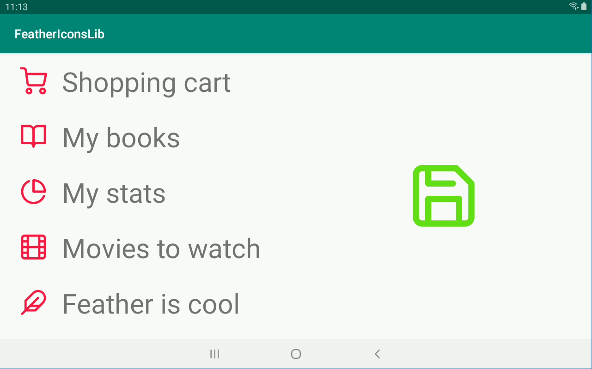

[](https://jitpack.io/#blastercoil/FeatherIcons-iconfont-lib)

# FeatherIconsLib

Feather iconfont wrapped in a library for convenience.  
Font sourced from https://github.com/AT-UI/feather-font

&nbsp;  

## Usage:

+ gradle //TODO

In XML:
```XML
<TextView
  style="@style/feather_font"
  android:layout_width="wrap_content"
  android:layout_height="wrap_content"
  android:text="@string/feather_help_circle"
/>
```

In code:
```kotlin
text_view?.text = FeatherIcons.feather_shopping_cart.glyph
  ```


## [License](LICENSE)
